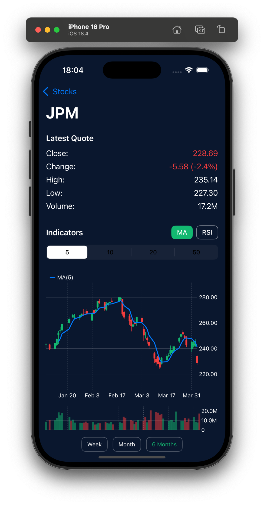

# StonksAI

A modern iOS stock market tracking application built with SwiftUI that provides historical stock data visualization.

> 🎵 This is an experimental Vibe-Coding project, crafted with [Cursor AI](https://cursor.sh/). This project is being developed as a learning exercise to explore mobile application development using AI tools. The focus is on gaining practical experience with AI-assisted workflows and building modern mobile solutions.
> The description below is also AI-generated 🦾🦾🦾.

## App Screenshot

## Features

- 📈 Real-time stock quotes for major companies
- 📊 Interactive price charts with historical data
- 💹 Detailed stock information, including:
  - Opening/Closing prices
  - High/Low values
  - Volume data
  - Price change calculations
  - Percentage changes
- 🎨 Modern UI with dark theme
- 📱 Responsive design optimized for iOS devices

## Technical Details

### Architecture
- Built with SwiftUI for modern, declarative UI
- MVVM (Model-View-ViewModel) architecture
- Async/await for network operations
- Modular service layer design

### Key Components

#### Services
- `MarketstackService`: Handles API communication with Marketstack
- `LoggerService`: Provides structured logging throughout the app

#### ViewModels
- `StocksViewModel`: Manages the main stocks list
- `StockDetailViewModel`: Handles individual stock details
- `StockRowViewModel`: Controls individual stock row presentation

#### Views
- `ContentView`: Main view with stocks list
- `StockDetailView`: Detailed view with historical data chart
- `StockRow`: Individual stock list item

### Data Models
- `StockQuote`: Core data model for stock information
- `MarketstackResponse`: API response structure
- `MarketstackError`: Error handling types

## Development

### Requirements
- iOS 15.0+
- Xcode 13.0+
- Swift 5.5+

### Setup
1. Clone the repository
2. Open `StonksAI.xcodeproj` in Xcode
3. Build and run the project

### Testing
The project includes unit tests for:
- ViewModels (StockRowViewModel)
- Services (MarketstackService)
- Data parsing and calculations

## Mock Data
The app includes mock data support for development and testing:
- Current stock data for 25 major companies
- Historical data with detailed price information
- Toggle between mock and real API data using `useMockData` flag

## Dependencies
- Marketstack API for stock data
- SwiftUI Charts for data visualization
- Foundation for networking and data handling

## Development Process
This project was developed using [Cursor AI](https://cursor.sh/), an AI-powered code editor that enhances the development workflow with intelligent suggestions and code generation.

## Credits
- Stock market data provided by [Marketstack](https://marketstack.com/)
- Icons and symbols from SF Symbols
- Built with ❤️ using Cursor AI
